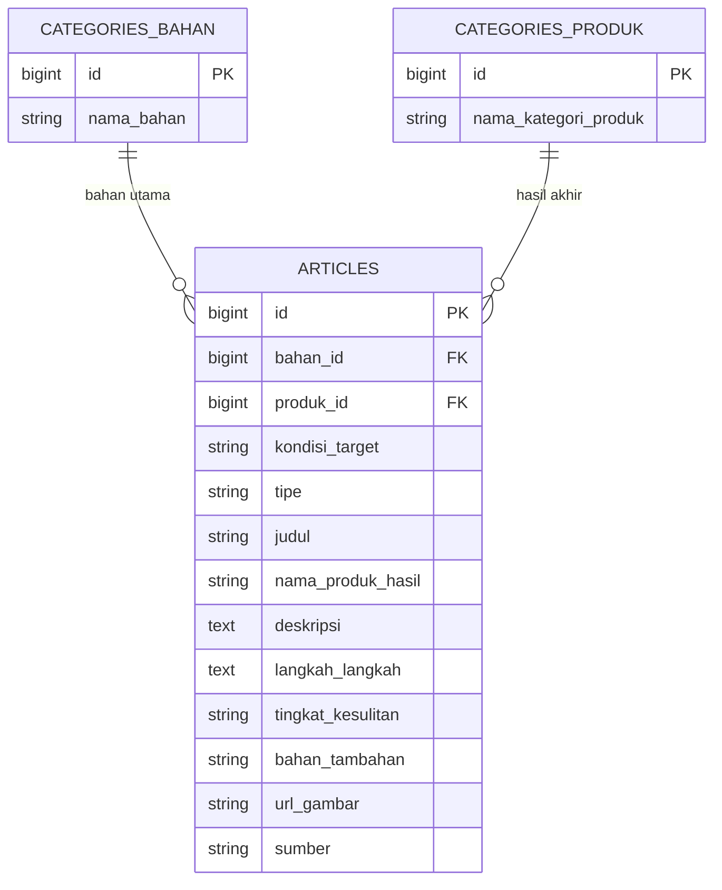

# RE:LOOP

Web app SDG 12.5 — membantu menentukan pemanfaatan barang bekas melalui reuse & upcycle.

---

## Anggota Kelompok

- Mochammad Mufid Mukhlis 140810250020
- Nadhir Rasyad Fikri Putra 140810250035
- Deardo Cristoph Damanik 140810250077

---

## Fungsi

RE:LOOP membantu pengguna menentukan apa yang bisa dilakukan terhadap barang bekas yang mereka miliki, lewat dua jalur:

1. **Scan Barang** — pengguna mengunggah foto barang, mengisi nama barang, dan kondisi (skala 1–10). AI (Gemini Vision + LLM) mengidentifikasi jenis barang & material, lalu memberi rekomendasi apakah barang lebih cocok di-**reuse** (dipakai ulang langsung) atau di-**upcycle** (diubah jadi barang baru), lengkap dengan contoh ide, tingkat kesulitan, dan bahan tambahan yang dibutuhkan.
2. **Explore** — jalur sebaliknya, pengguna menjelajahi ide berdasarkan jenis bahan yang dimiliki atau produk yang ingin dibuat, tanpa perlu mengunggah foto.

Aplikasi ini tidak memerlukan login/akun — siapa pun bisa langsung memakainya, dan hasil scan tidak disimpan sebagai riwayat pribadi.

---

## Tujuan

RE:LOOP dibuat untuk memenuhi **SDG 12.5** (Responsible Consumption and Production), yang berfokus pada pengurangan timbulan sampah lewat prevention, reduction, recycling, dan reuse.

Secara spesifik, RE:LOOP menyasar sisi **reuse** dan **prevention/reduction** dari target tersebut:
- **Prevention & reduction** — mencegah barang yang sebenarnya masih bisa dimanfaatkan agar tidak buru-buru berakhir menjadi sampah.
- **Reuse** — mendorong barang dipakai kembali sesuai atau mendekati fungsi aslinya, atau diubah (upcycle) menjadi sesuatu yang baru dan berguna, sebagai alternatif sebelum barang benar-benar dibuang.

---

## Target Pengguna

- Individu/masyarakat umum yang memiliki barang bekas di rumah dan tidak tahu harus diapakan.
- Pelajar/mahasiswa atau siapa pun yang tertarik pada ide DIY dan kerajinan dari barang bekas.
- Siapa saja yang ingin mengurangi kebiasaan langsung membuang barang tanpa mempertimbangkan pemanfaatan ulang — tanpa hambatan akun/login.

---

## Mockup Kasar Sederhana

---

## Skema Database

